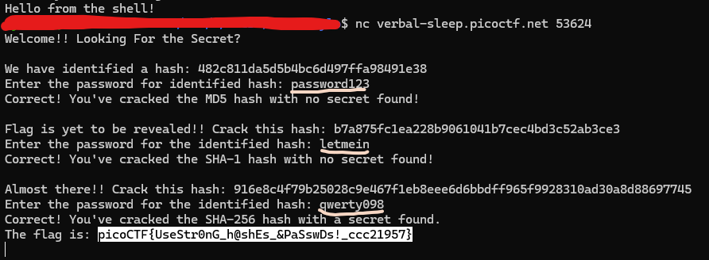

## HashCrack 

### Description 

A company stored a secret message on a server which got breached due to the admin using weakly hashed passwords. Can you gain access to the secret stored within the server?

Additional details will be available after launching your challenge instance.

### Inspection 

When we access the server using `nc verbal-sleep.picoctf.net 53624`, we are given a hash "482c811da5d5b4bc6d497ffa98491e38". It seems like an <b>MD5</b> hash. The reason is because: 

- It is <b>32 hexadecimal characters long</b>

- MD5 outputs <b>128 bits</b>, which is shown as <b>32 hex characters</b>. 

When we reverse this hash using a website such as <a href="md5hashing.net">THIS</a>, to reverse the hash, we get `password123` which works. 

Now, we are given another hash which is "b7a875fc1ea228b9061041b7cec4bd3c52ab3ce3" which is a <b>SHA-1</b> hash. This is because of the following: 

- It is <b>40 hexadecimal characters long</b>, which corresponds to <b>160 bits</b>. When we reverse the hash using that same website, we get `letmein` which works. 

- We are give another hash " 916e8c4f79b25028c9e467f1eb8eee6d6bbdff965f9928310ad30a8d88697745" which is a <b>SHA-256</b> hash. This is due to the fact: 

- It is <b>64 hexadecimal characters long</b>. 

- When reversed, we get `qwerty098` 

Finally we found the the flag `picoCTF{UseStr0nG_h@shEs_&PaSswDs!_ccc21957}`. 

