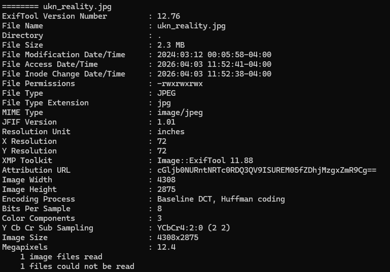

## CanYouSee

### Description

How about some hide and seek?

### Inspection 

After running `exiftool decoded ukn_reality.jpg`, I get:

The Attribution URL is Base64, thus, we can decode it. When I decoded I get picoCTF{ME74D47A_HIDD3N_d8c381fd}

Note, the <b>Attribution URL</b> is a metadata field that credits the origin of the image. In most cases, it should be plain `https://`. 