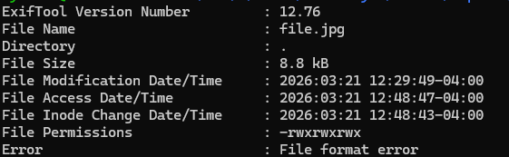
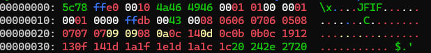
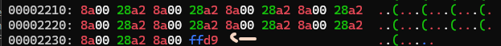
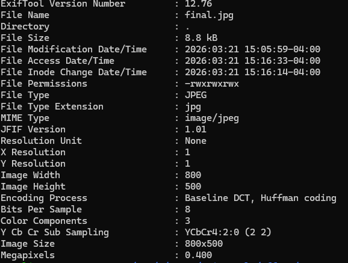

## Corrupted File 

### Description 

This file seems broken... or is it? Maybe a couple of bytes could make all the difference. Can you figure out how to bring it back to life?

### Inspection

When running it through a meta data tool, the file name is `82b9aa7de7677a2079200e003451394c`. This seems like an MD5 hash based on the ASCII format and it being 32 characters. We should also check the checksum which is `d40dd10a331d437383586f3a8e35e6cf`. 

When looking at the file, it has a string called `JFIF` which stands for "JPEG File Interchange Format". This is an image format that uses JPEG compression to store and exchange image data. I changed the file name to `file.jpg`. 

Lets inspect it using exiftool: 

- After performing `exiftool file.jpg`, i get: 

    

    There is a problem here, we should not get a file format error since a normal JPEG with a JFIF header should not throw an error. This is almost certain this file is corrupted. The next step we should perform is looking at the raw bytes 

- We can look at the at the raw bytes of the file by performing `xxd file.jpg`.  

    

    

    This is strange because all .jpg files begin with `ffd8` and not `5c78`. However, the ending is `ffd9` which is an <b>End of Image (EOI) marker</b>.

     In the <b>ASCII representation</b> which is right of the actual raw data in hex, we see a `\x`, where `5c ` = `\` and `78` = `x`. This means this file is not pure binary JPEG, it looks like an escape character (). 

We need to correct the `ffd8` bytes. To do so, we can use the command `xxd file | head -n 1` to to exam the hex and ASCII again. Then we can do `(printf '\xff\xd8' && tail -c +3 file) > final.jpg`

- <b>(printf '\xff\xd8')</b>: This manually adds the valid JPEG header so the <b> Start Of Image (SOI)</b>. 

- <b>&&</b>: If the first command is successful, the second command will execute below. 

- <b>(tail -c +3 file)</b>: This outputs the bytes from 3 onwards so skips over the first 2 bytes which are `5c 78`. 

- <b> final.jpg</b>: Writes the output of the commands into a new file called final.jpg.  

To test if it worked, lets perform `exiftool final.jpg`

It worked. All we have to do is look at the actual image ↓

