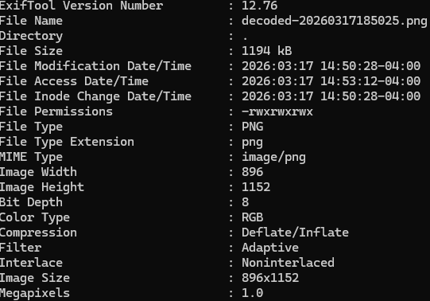
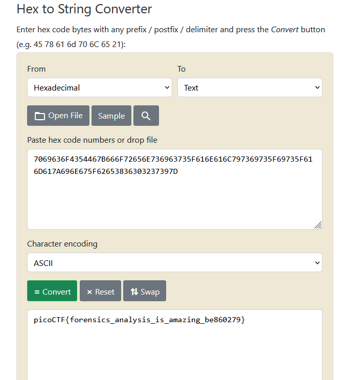

## Flag in Flame 

### Description  

The SOC team discovered a suspiciously large log file after a recent breach. When they opened it, they found an enormous block of encoded text instead of typical logs. Could there be something hidden within? Your mission is to inspect the resulting file and reveal the real purpose of it. The team is relying on your skills to uncover any concealed information within this unusual log. Download the encoded data here: Logs Data. Be prepared—the file is large, and examining it thoroughly is crucial .

### Inspection 
- It seems to be 64 bit encoded since the last characters of the file are `==`
- I decoded it and we got an image. The checksum of the file is "e232cb480c54fc10f11531f38036dbc8". Remember, that the checksum is usually a fingerprint of a file. If able to decode, then it is not really a checksum as they are one-way. 

Lets use a new tool called `exiftool` to read its <b>metadata</b>. To download, use ` sudo apt install libimage-exiftool-perl -y`, then perform `exiftool decoded-20260317185025`, or the image name. 

There is no weird metadata here, meaning the flag is not here. We can eliminate this method and try something else. 

In the image, there is text at the bottom which is `7069636F4354467B666F72656E736963735F616E616C797369735F69735F616D617A696E675F62653836303237397D`. This does not look like a hash at all, it is hex characters. We can probably convert them from <b>Hex to String</b>

- It works, we got our flag. 