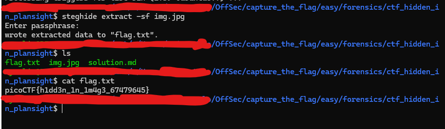

## Hidden in Plain sight

### Description  

You’re given a seemingly ordinary JPG image. Something is tucked away out of sight inside the file. Your task is to discover the hidden payload and extract the flag.

### Inspection 

- The metadata field `comment` contains c3RlZ2hpZGU6Y0VGNmVuZHZjbVE9l, which seems like a Base64 string. By decoding it, we get "steghide:cEF6endvcmQ=". Again, when we decode this, we get "'^pAzzword". I think this is a possibly a password.  

- `steghide` is interesting. After doing some research, it is a steganography tool which means it hides information such as text or files. It seems we can extract the hidden data with this tool. 

Install `steghide`

```bash
    sudo apt install steghide -y #-y assumes yes to all prompts like "[Y/n]"
```

- Based on this <a href="https://steghide.com/extract-hidden-data-from-a-file-with-steghide/">documentation</a>, we can use the command `steghide extract -sf image.jpg` for extraction. 



- Enter the passphrase: `pAzzword`, then `cat flag.txt`. We got the flag! 