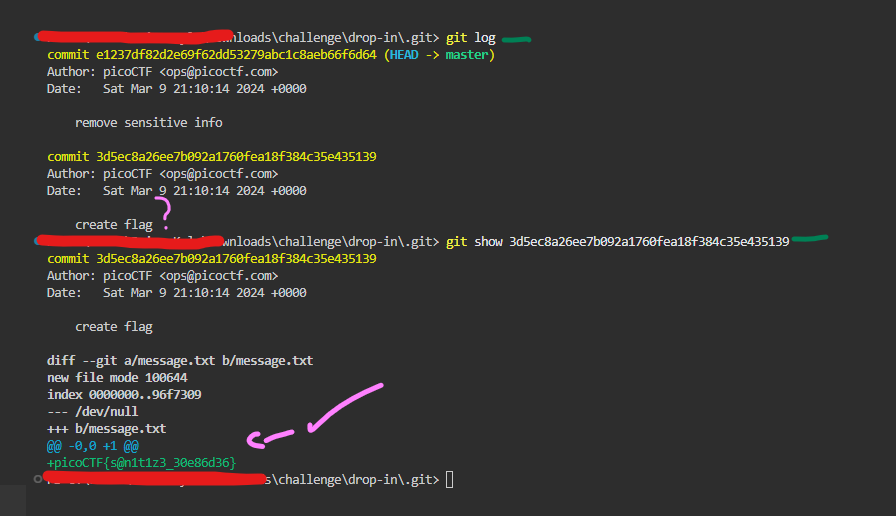

## Commitment Issues 

### Description 

I accidentally wrote the flag down. Good thing I deleted it! You download the challenge files here:

- challenge.zip

### Inspection 

- When extracting the ZIP file, I went through each file to see if any flags were there. Unfortunately, this time, there was none. Then, I decided to see the log history, I found something suspicious. 

For one of the commits, the message was "create flag", so this may indicate the flag was made during this commit. I used the command `git show 3d5ec8a26ee7b092a1760fea18f384c35e435139` or the shorter version `git show 3d5ec8a`. This gave us the flag "picoCTF{s@n1t1z3_30e86d36}". NOTE! that long text is a commit hash. 

- <b>git show:</b> This command displays information about an object in Git, mainly for a commit. It shows what files were added, removed or modified. Also the `+` = <b>line added</b>, `-` = <b>line removed</b>. 

